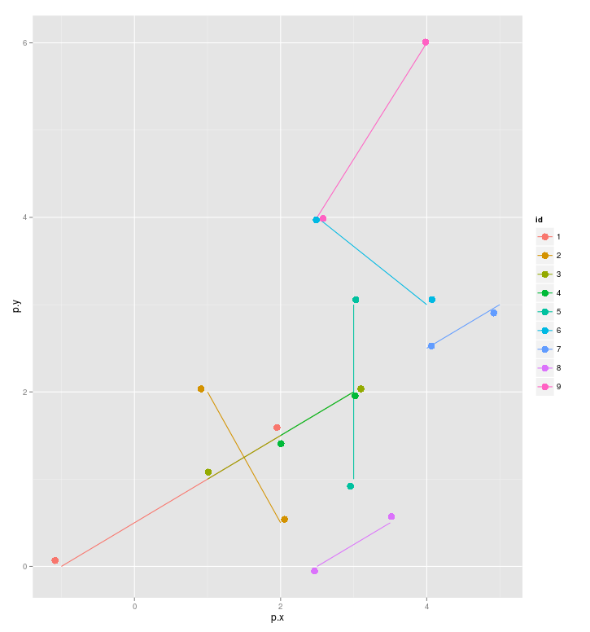

1. Aufgabe aus Computational Geometry
=====================================

Jakob Schöttl, Markus Stampfl


Implementierung
---------------

Im ersten Schritt haben wir die Aufgabe in C++ gelöst.  Das Programm findet
sich im Ordner `cpp/` und kann über das darin enthaltenen Makefile erstellt
werden.

Für den Algorithmus haben wir auf Papier alle möglichen Fälle aufgezeichnet
und konnten durch jedes weitere if-Statement in der Funktion `intersect` eine
weitere Gruppe abhaken, bis alle Fälle behandelt waren.

Wir haben hier nach dem Ansatz "return early" programmiert.  Dadurch ist der
Code leicht zu lesen und nachzuvollziehen, weil mit jedem return-Statement
ein weiterer Fall einfach abgeschlossen ist, und man diesen nicht mehr im
Hinterkopf behalten muss.  Außerdem spart man sich Variablen und Einrückungen,
was auch zu sauberem Code beiträgt.

Das C++-Programm haben wir dann in die funktionale Programmiersprache Haskell
übersetzt.  Der Algorithmus selbst ist in Haskell noch prägnanter; das
Drumherum war eine größere Herausforderung.  Die Haskell-Implementierung
liegt in `haskell/Main.hs`.  Als Build-System verwenden wir Cabal.  Mit
`cabal build` in `haskell` sollte das Programm erzeugt werden.


Aufruf der Programme
--------------------

Beide Programme lesen die Eingabedaten von der Standardeingabe.  Die Laufzeit
kann unter Linux mit dem Programm `time` ermittelt werden.  Beispiel:

    time cpp/intersect < data/test.dat

Um den Programmaufruf mit den verschiedenen ausführbaren Dateien und
Eingabedateien zu vereinfachen gibt es das Skript `test/run-intersect.sh`.


Test der Programme
------------------

Anhand einer kleinen Beispieldatei haben wir unser Programm getestet:
`data/test.dat`.  Hier eine Visualisierung; alle Punkte ist allerdings
um einen zufälligen kleinen Wert verschoben, damit es keine vollkommenen
Überlappungen gibt.



Dazu wird das Skript `test/run-test.sh` verwendet, das unser Programm
mit folgenden Eingaben testet:

* Liste der Strecken in richtiger und in auch in umgekehrter Reihenfolge.
* Dazu jeweils Anfang- und Endpunkte der Strecken in richtiger Reihenfolge
  aber auch vertauscht.

Test erfolgreich: Es kommen immer die acht Schnittpunkte heraus.


Laufzeituntersuchungen
----------------------

Die C++-Implementierung ist wie erwartet schneller als das Haskell-Programm.
Mit Haskell arbeitet man einfach auf einer höheren Abstraktionsebene, mit
Listen und map...  Und so gut kann der Compiler diese Unterschiede wohl nicht
wegoptimieren.  Die Daten hierzu liegen in `test-c-vs-h/` und können mittels
dem Makefile reproduziert werden.

Die Laufzeit von Haskell hat uns anfangs Schwierigkeiten bereitet, da sie
nicht quadratische Laufzeit sondern O(n^4) hatte.  Und das, obwohl wir nur
*nacheinander* (nicht verschachtelt) zwei Funktionen quadratischer Laufzeit
verwendet haben.  Grund war, dass die erste Funktion eine Liste mit n^2 Elementen
erzeugt hat, und auf diese neue, viel längere Liste wurde die zweite Funktion
losgelassen.  Damit ist die Laufzeit dann natürlich O((n^2)^2) = O(n^4).
Jetzt ist es natürlich schlauer implementiert.
Vgl. [Hilferuf per E-Mail](test-haskell-with-nubBy/Haskell_Programmlaufzeit.eml)
-- dort sind auch Plots mit der Programmlaufzeit über n zu finden.
Die Ergebnisse liegen in `test-haskell-with-nubBy/` und `test-haskell/`.


Ergebnisse
----------

Beide unsere Implementierungen kommen auf die gleichen Ergebnisse:

C++-Programm:

```
processing data/s_100000_1.dat
77126

real    14m31.288s
user    14m29.221s
sys     0m0.045s
processing data/s_10000_1.dat
732

real    0m8.640s
user    0m8.591s
sys     0m0.008s
processing data/s_1000_1.dat
11

real    0m0.134s
user    0m0.101s
sys     0m0.002s
processing data/test.dat
8

real    0m0.010s
user    0m0.002s
sys     0m0.002s
```

Haskell-Programm:

```
processing data/s_100000_1.dat
77126

real    45m11.446s
user    44m53.759s
sys     0m7.507s
processing data/s_10000_1.dat
732

real    0m17.407s
user    0m17.268s
sys     0m0.088s
processing data/s_1000_1.dat
11

real    0m0.175s
user    0m0.149s
sys     0m0.024s
processing data/test.dat
8

real    0m0.008s
user    0m0.004s
sys     0m0.004s
```


Maschinenengenauigkeit und Epsilon
----------------------------------

Dieser Abschnitt gilt nur für das C++-Programm.

Hier hatten wir so unsere Probleme:  Welches Zahl verwenden wir als Epsilon?
Es gibt ja für die Gleitkommadatentypen eine Maschinengenauigkeit, in C++
zum Beispiel `numeric_limits<double>::epsilon()`.  Um diese jedoch sinnvoll
verwenden zu können, müsste man jedoch die Fehlerfortpflanzung betrachten.
Bei Multiplikation hängt der Fehler des Ergebnisses auch stark vom absoluten
Zahlenwert ab.  Dieser Ansatz wurde hier nicht weiter verfolgt.

Wir haben per Bash-Skript verschiedene feste Epsilon getestet (im Ordner
`test-epsilon/`).  Hier eine Liste der Epsilon zusammen mit der jeweiligen
Anzahl der Schnittpunkte in Testdatei `data/s_1000_1.dat`.

```
1e-1 34
1e-2 17
1e-3 13
1e-4 11
1e-5 11
1e-6 11
1e-7 11
1e-8 11
1e-9 11
1e-10 11
```

Bei kleinen Epsilon sieht man keinen Unterschied im Ergebnis, bei sehr großen
Epsilon ab 0.001 werden erwartungsgemäß mehr Schnittpunkte gefunden.

Das Epsilon spielt bei folgenden Vergleichsoperationen eine Rolle:
`==`, `>=`, `<=`.

Hier haben wir die Funktionen `isEqualToZero` und `isLessThanOrEqualToZero`
definiert.

Werden, die eingelesen Daten direkt verwendet (`inRange`), verwenden wir normale
Vergleiche (ohne Epsilon), da siebenstellige Daten ohne Fehler in
double-Variablen eingelesen werden.  In allen Eingabedateien haben alle Zahlen
maximal sieben Stellen:

    $ grep -E '[[:digit:].]{8,}' data/*.dat | wc -l
    0


Parallelisierbarkeit
--------------------

Wir haben uns auch noch Gedanken gemacht, wie die Rechenzeit verkürzt
werden könnte, mit möglichst geringen Eingriffen in das Programm.  Eine gute
und einfache Möglichkeit wäre, dem Programm einen Kommandozeilenparameter
mitzugeben, der sagt, bis zu welcher Zeile der Eingabedatei, die äußere
Schleife laufen soll.  Die äußere Schleife, ist die, die nacheinander eine
Strecke herausgreift und gegen alle folgenden Strecken auf Schnittpunkte testet.

Angenommen, die Eingabedatei `test.dat` hat 1000 Zeilen. Dann kann das
Programm auf einem Zweikernprozessor wie folgt parallel gestartet werden:

1. `./intersect -l 300 < test.dat`
2. `awk 'NR>300' test.dat | ./intersect`

Dieser Ansatz kann für beliebig viele Prozessoren erweitert werden.
Die Zahlen sind aber hier rein geschätzt, lassen sich aber natürlich
auch sinnvoll berechnen.

Hier der Test unseres Ansatzes zur Parallelisierung (mit Vergleich):

```
$ time cpp/intersect < data/s_100000_1.dat
77126

real    14m38.739s
user    14m36.677s
sys     0m0.028s

$ time cpp/intersect -l 30000 < data/s_100000_1.dat & \
> awk 'NR>30000' data/s_100000_1.dat | time cpp/intersect &
[1] 5204
[2] 5207

...

[1]-  Fertig                  time cpp/intersect -l 30000 < data/s_100000_1.dat
[2]+  Fertig                  awk 'NR>30000' data/s_100000_1.dat | time cpp/intersect
```

Ergebnisse:

```
[2] 7:18.30 min
37880

[1] 7:29.18 min
39246

37880 + 39246 = 77126
```

Siehe da, die Schätzung für die Aufteilung der Datei (30 zu 70 Prozent)
passt sehr gut.  Die zwei Prozesse werden fast gleichzeitig fertig und
laufen statt 14 Minuten nur 7 Minuten.  Und das Tollste: Die Summe der
beiden Ergebnisse der parallel gestarteten Prozesse ergibt dasselbe
Ergebnis wie oben :-)
